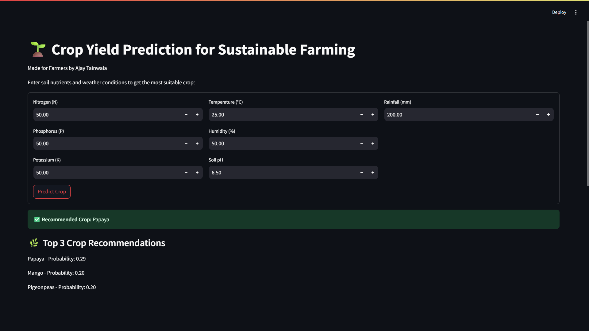

# 🌾 Crop Yield Prediction using Machine Learning

This project predicts **crop yield** based on environmental and agricultural factors using **Machine Learning**.

It provides both:

* 📒 **Jupyter Notebooks** (`Solution.ipynb`, `Form.ipynb`, `WebPage.ipynb`) for data analysis, model training, and experimentation
* 🌐 **Streamlit Web Application** (`crop_app.py`) for interactive predictions
* 📂 **Dataset.csv** containing training data
* 💾 **models/** directory with trained ML models
* 📊 **outputs/** directory with prediction results and visualizations

---

## 📂 Repository Structure

```
├── Dataset.csv            # Dataset used for training & testing
├── Solution.ipynb         # End-to-end ML pipeline (EDA + training + evaluation)
├── Form.ipynb             # Notebook for form/input experimentation
├── WebPage.ipynb          # Notebook for web UI prototype
├── crop_app.py            # Streamlit web app for crop yield prediction
├── models/                # Saved trained ML models
├── outputs/               # Predictions & visualizations
├── requirements.txt       # Project dependencies
└── README.md              # Documentation
```

---

## ⚙️ Installation

Clone the repository:

```bash
git clone https://github.com/ajaytainwala-dev/ML_CROP_YIELD.git
cd ML_CROP_YIELD
```

Create a virtual environment (recommended):

```bash
python -m venv venv
source venv/bin/activate   # Mac/Linux
venv\Scripts\activate      # Windows
```

Install dependencies:
>requirements.txt
```text
scikit-learn
pandas
streamlit
xgboost
shap
PIL
seaborn
matplotlib
numpy
```

```bash
pip install -r requirements.txt
```

---

## ▶️ Usage

### 🔬 Run the Jupyter Notebooks

```bash
jupyter notebook Solution.ipynb
```

* Perform exploratory data analysis (EDA)
* Train ML models
* Evaluate performance

Other notebooks (`Form.ipynb`, `WebPage.ipynb`) explore input handling and UI development.

---

### 🌐 Run the Streamlit Web App

```bash
streamlit run crop_app.py
```

* Input agricultural parameters (e.g., rainfall, temperature, soil type, fertilizer usage)
* Get predicted crop yield instantly
* View results with plots & metrics

Open in browser: [http://localhost:8501](http://localhost:8501)

---

## 📦 Requirements

Main dependencies:

* `streamlit` – interactive web app
* `pandas`, `numpy` – data preprocessing
* `scikit-learn` – ML model training & evaluation
* `matplotlib`, `seaborn` – visualizations
* `jupyter` – running notebooks

(Full list in `requirements.txt`)

---

## 🌟 Features

* ✅ End-to-end **Crop Yield Prediction** pipeline
* ✅ Jupyter Notebooks for training & analysis
* ✅ Pre-trained models saved in `models/`
* ✅ Streamlit app for real-time predictions
* ✅ Visualizations and reports in `outputs/`
* ✅ Ready-to-use dataset (`Dataset.csv`)

---

## 📸 Screenshots




---

## 🤝 Contributing

Contributions are welcome! Fork the repo, create a new branch, and submit a pull request.

---

## 📜 License

This project is licensed under the MIT License - see the [LICENSE](LICENSE) file for details.

---

👉 Do you also want me to **generate the `requirements.txt` automatically from your notebooks & `crop_app.py`** so it’s complete and you can push it to GitHub?
